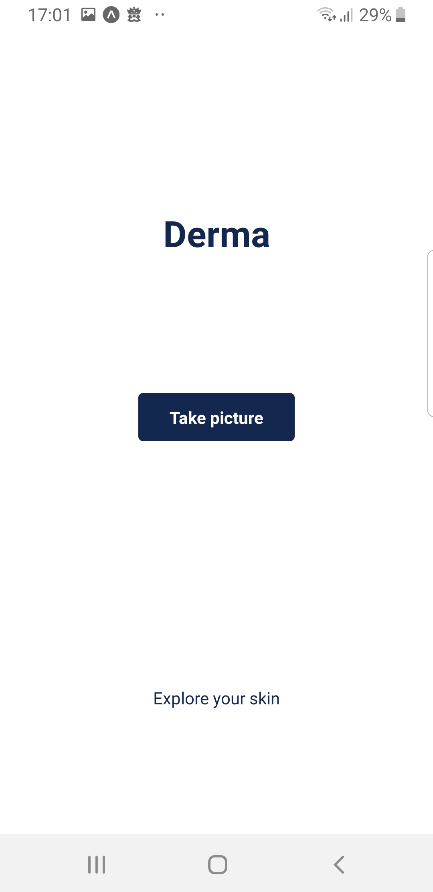
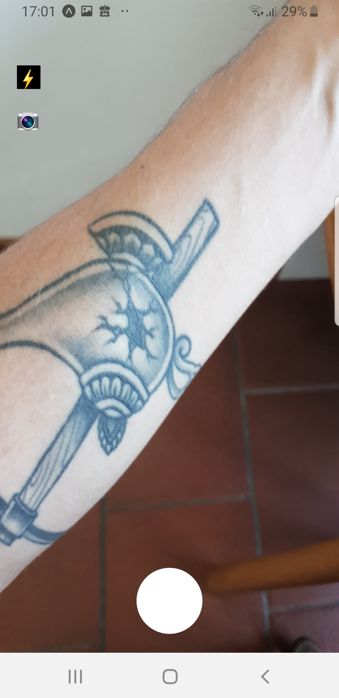
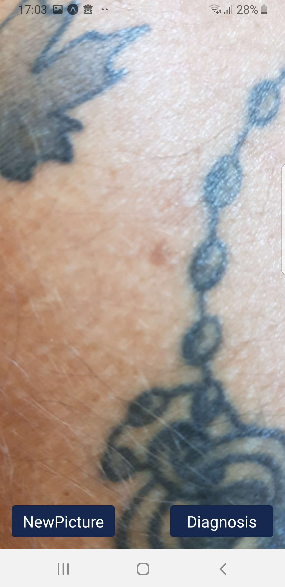
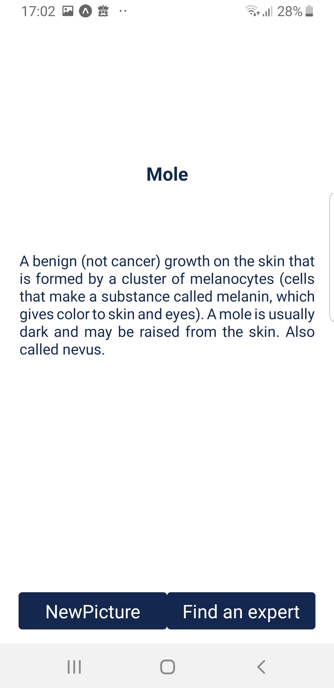
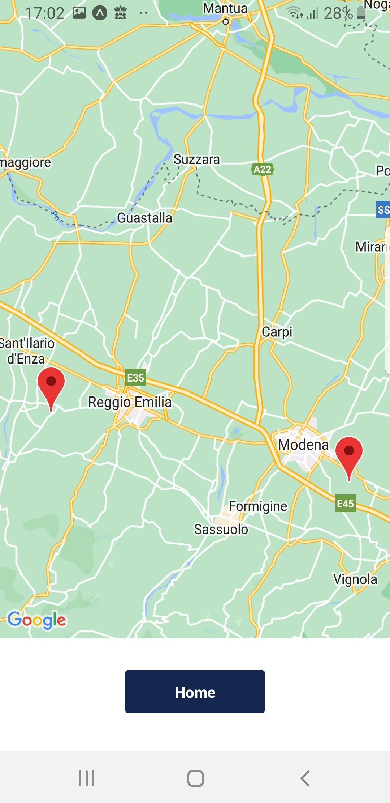
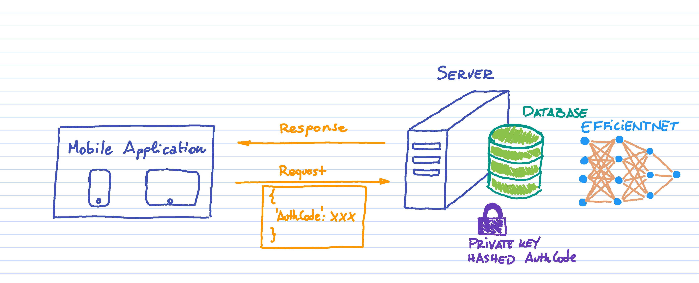

<div id="top"></div>

[![Contributors][contributors-shield]][contributors-url]
[![Forks][forks-shield]][forks-url]
[![Stargazers][stars-shield]][stars-url]
[![Issues][issues-shield]][issues-url]


<br />
<div align="center">
  
  <h1 align="center">Derma</h1>

  <a href="https://github.com/mattianeroni/derma">
    
  </a>
  
  
  
  <p align="justify">
    Derma is a <b>mobile application for Android and iOS</b> for detection and recognition of skin deseases. This repository contains both the mobile application written in React Native, and the server code to manage the database and the ML model. 
  </p>
  <p align="justify">  
    The application is able to detect from a picture <b>9 different kinds of skin desease</b>, and the classification is carried out through a fine tuned <b>EfficientNet</b> model. The application is therefore making use of Artificial Intelligence (AI) to identify an eventual skin illness. It is designed to be simple and easy-to-use.
  </p>

</div>


```bibtex

@inproceedings{tan2019efficientnet,
	title={Efficientnet: Rethinking model scaling for convolutional neural networks},
	author={Tan, Mingxing and Le, Quoc},
	booktitle={International conference on machine learning},
	pages={6105--6114},
	year={2019},
	organization={PMLR}
}

```

## Table of contents

- [Screens](#screens)
- [Built With](#built-with)
- [Architecture](#architecture)
- [Todo Before Usage](#todo-before-usage)
- [Todo Development](#todo-development)
- [Contact](#contact)


### Screens

Derma application is essentially made of 5 simple screens. A quick overview is reported below.

##### Home page
Once arrived to the home page, just click the button `Take picture` to open the camera.

<div align="center">

</div>

##### Camera
After requiring the permissions needed, the app will open the camera, where the user has the possibility to switch on the flash and use both front and back cameras. Just take a picture to the interested area of the skin.

<div align="center">

</div>

##### Confirmation
Once token the picture, the user will have the possibility take a new one (in case the first picture was not satisfactory) or send the image to the server for the diagnosis.

<div align="center">

</div>

##### Diagnosis
The server executes the above mentioned Convolutional Neural Network (CNN) model (i.e., EfficientNet) and provides a response.

<div align="center">

</div>

##### Experts
Finally, in the last page, the application provides a dynamic overview of the associated doctors and dermatologists in close proximity to the user, so that he/she can go and seek more reliable and trustworthy consultancy.

<div align="center">

</div>


### Built With

* [ReactNative](https://reactnative.dev/)
* [FastAPI](https://fastapi.tiangolo.com/)
* [SQLAlchemy](https://www.sqlalchemy.org/)

<p align="right">(<a href="#top">back to top</a>)</p>


## Architecture

The application has a classic *server side model* application, and, as visible in this very nice draw, it is made of a mobile application that is communicating with a server where a database and the machine learning model can be found.



Every time a request is sent to the server, the request headers must contain an authorization code that is verified by the server middleware. For important changes that affect the database an *admin token* should also be provided. Once provided, the authorization and admin tokens are encrypted using the `SALT` and compared with the ones stored in the `ENCODED_AUTHORIZATION`, i.e., a dictionary encoded using the `PRIVATE KEY`.

The database currently contains a single table where are stored the dermatologists to consult with their respective contacts and coordinates.


<p align="right">(<a href="#top">back to top</a>)</p>


## Todo Before Usage

- [ ] Update the variables in the `.env` files both in the application and in the server: be sure that the authorization token and the server URL in the mobile application correspond to the ones encrypted into the server `ENCODED_AUTHORIZATION` generated using the `PRIVATE KEY` (yes, the security is eccessive for this kind of application). The current admin authorization token to modify the database is `FuckYou`.

<p align="right">(<a href="#top">back to top</a>)</p>


## Todo Development
- [ ] Test on iOS
- [ ] The middleware is currently not working, probably because the *SQLAlchemy Async Session* doesn't work well with *aiosqlite*. An [issue](https://stackoverflow.com/questions/73854952/fastapi-aiosqlite-asyncsession-exception-closing-connection) is currently open on Stackoverflow.

<p align="right">(<a href="#top">back to top</a>)</p>


## Contact


Mattia Neroni, Ph.D., Eng. - mattianeroni@yahoo.it - LinkedIn: [mylinkedin]

Website: https://mattianeroni.github.io

Project Link: https://github.com/mattianeroni/derma

Github Account: https://github.com/mattianeroni/

<p align="right">(<a href="#top">back to top</a>)</p>


<!-- MARKDOWN LINKS & IMAGES -->
<!-- https://www.markdownguide.org/basic-syntax/#reference-style-links -->
[contributors-shield]: https://img.shields.io/github/contributors/mattianeroni/derma.svg?style=for-the-badge
[contributors-url]: https://github.com/mattianeroni/derma/graphs/contributors
[forks-shield]: https://img.shields.io/github/forks/mattianeroni/derma.svg?style=for-the-badge
[forks-url]: https://github.com/mattianeroni/derma/network/members
[stars-shield]: https://img.shields.io/github/stars/mattianeroni/derma.svg?style=for-the-badge
[stars-url]: https://github.com/mattianeroni/derma/stargazers
[issues-shield]: https://img.shields.io/github/issues/mattianeroni/derma.svg?style=for-the-badge
[issues-url]: https://github.com/mattianeroni/derma/issues
[mylinkedin]: https://www.linkedin.com/in/mattia-neroni-081965101/

